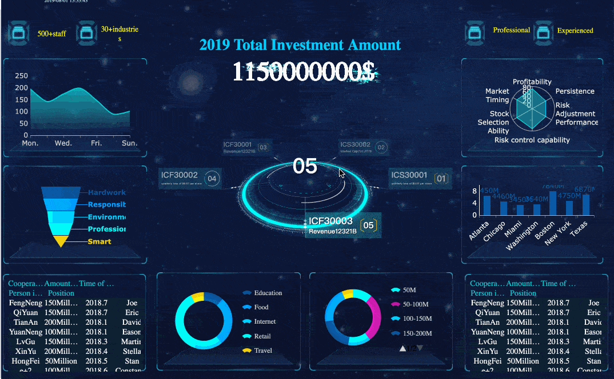

# Ironhack final project

<!--  -->

# End-to-end ML model example

## Overview
The objective of the project is to walk, step by step through the different processes involved
in the generation of a machine learning model:
* 1. Extraction, Transformation and Loading (ETL)
* 2. Data Visualization
* 3. Machine Learning Model
    * Model Selection
    * Feature Engineering
    * Model Training
    * Model Evaluation
    * Model Prediction
    * Model Validation

## ETL
In this section we will use ETL to extract data from the marvel Api, make some transformations
and show the results in a web page. we'll use the followings techniques:
* Data Acquisition (Api request)
* Data Cleaning
* Feature Engineering

Also We'll download the dataset "Marvel characters" published in kaggle in the following link:
<a href="https://www.kaggle.com/dannielr/marvel-superheroes"
    target="_blank">kaggle-marvel-characters</a>
At the end we'll define 2 datasets, 1 for training and 1 for predictions,
The first has 344 rows and 14 variables, while the second has 166 rows and 14 variables.

## Data Visualization
Data Visualization is the process of better understand the data using graphics and charts,
has the power to tell data-driven stories while allowing people to see patterns and relationships
found in data.

In this section we will create and interpret different types of visualizations to better
understand the datases we are working with.

## Supervised Machine Learning model
Supervised ML model
In this section we will implement a Logistic Regression model to predict whether the
alignment of second dataset characters are good or bad.
But... what is Logistic Regression?, Logistic regression is a classification technique that gives
the probabilistic output of dependent categorical value based on certain independent variables,
which the output is considered as 1 and below the threshold, the output is considered as 0.

## Useful Resources
* [Marvel's developers web page](https://developer.marvel.com/)
* [Requests Library Documentation: Quickstart](http://docs.python-requests.org/en/master/user/quickstart/)
* [Marvel's dataset](https://www.kaggle.com/dannielr/marvel-superheroes)
* [Flask: Quickstart](https://flask.palletsprojects.com/en/2.0.x/quickstart/)
