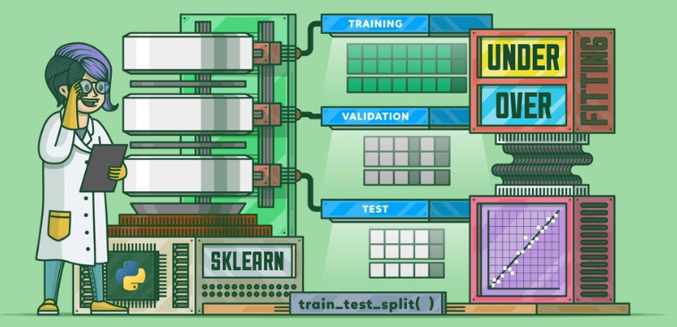

# Ironhack DATAMEXPT2021 final project

<!--  -->

# Marvel Comics data analysis

### by Lucio Gutiérrez Román

## Overview
The project's goal is walkthrough some skills learned at the bootcamp by
analysis the characters of Marvel Comics.

Hypothesis: Machine learning models can be implemented in a
systematically way...

Test hypothesis: We will implement a machine learning model step-by-step using generical fuctions.

I have used the following technologies learned in this course: Python,
Flask, Api requests, Data Analysis, Data Visualization, Machine
Learning, Pythonanywhere, among others.

## Data Preparation

In this section we will prepare the data to be used in the machine
learning model:
In this section we will prepare the data to be used in the machine
learning model:
Data Acquisition
* Marvel Api <a href="https://developer.marvel.com/" target="_blank">https://developer.marvel.com/</a>
* Keggle Marvel Superheros datasets <a href="https://www.kaggle.com/dannielr/marvel-superheroes"
            target="_blank">kaggle-marvel-superheros</a>
* Data Wrangling
* Data Cleaning
* Data Analysis
* Data Sotorage

to define 2 datasets, 1 for training and 1 for predictions.

## Data Visualization
Data Visualization is the process of better understanding the data using graphics and charts,
has the power to tell data-driven stories while allowing people to see patterns and relationships
found in data.

In this section we will create and interpret different types of visualizations to better understand
datasets we are working with.

## Machine Learning Model
In this section we will develop step-by-step a machine learning model:
* Model Selection
* Feature Engineering
* Model Training
* Model Evaluation
* Model Prediction
* Model Validation

## Useful Resources
* [Marvel's developers web page](https://developer.marvel.com/)
* [Requests Library Documentation: Quickstart](http://docs.python-requests.org/en/master/user/quickstart/)
* [Marvel's dataset](https://www.kaggle.com/dannielr/marvel-superheroes)
* [Flask: Quickstart](https://flask.palletsprojects.com/en/2.0.x/quickstart/)
